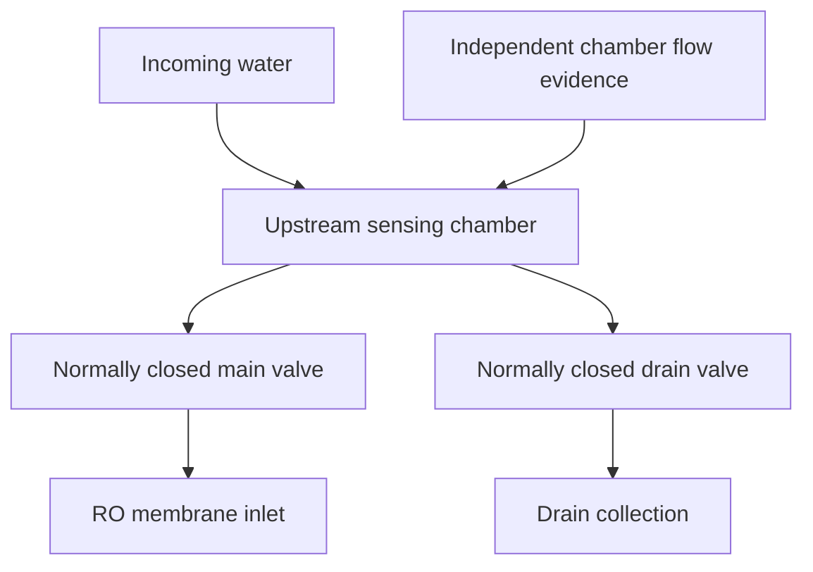

# Hardware and software connection guide

## Your original flowchart mapped to executable behavior

| Original block | Connected implementation | Output / interlock |
|---|---|---|
| Sensor acquisition, 1 Hz | `sensor_adapter.h` → ESP32 NDJSON → `HardwareSerial` → `GateController.step()` | TDS ppm, pH, water temperature, sequence, validity and freshness evidence |
| Statistical baseline, 30 days | Source-specific minute aggregates of qualified samples | Mean, sigma and adaptive bands clamped by commissioning bounds |
| Temporal recognition / flush | Violation duration, immediate measurement gating, recovery FSM | Transient/persistent labels do not delay a hard trip; commissioned drain command |
| Cross-parameter correlation | Rolling TDS/pH and TDS/temperature Pearson correlations, diagonal standardized profile distance | Diagnostic relationships, unknown-source lockout; no contaminant identification |
| Predictive membrane module | Observed/admitted/blocked stress integration | Input proxy for a future validated model; no invented replacement date |
| Sensor fault / inference | Invalid/range/sequence/time/frozen checks before permission; regression estimate diagnostic only | Failed or inferred sensor cannot independently authorize opening |
| Dual-mode risk | Joint deviation risk indicator; Protect / bounded Emergency modes | Emergency can relax only statistical gating, never hard measurement/source/freshness interlocks |
| AND logic / valve | All measurement intervals AND source AND valid/fresh data AND recovery AND no manual latch | Mutually exclusive main/drain commands, acknowledgement monitoring, firmware local veto |

The fault veto is evaluated before learning and actuation even though it appears later in the supplied conceptual flowchart. This prevents invalid measurements from entering the trusted baseline. This is a continuously repeating control loop, not a one-shot START-to-STOP program.

## Fluid topology



The chamber must have fresh inlet-water flow during closed-main recovery. A drain branch is one option; a separate continuous sample loop is another. Opening a drain command is not proof that flushing happened. A commissioned flow sensor/switch or equivalent independent acquisition evidence must drive `fresh`. If none exists, report `fresh:false`; automatic reopening remains inhibited. Repeated timestamps, changing electrical noise and valve commands cannot establish freshness.

The main valve isolates the membrane while the upstream drain is open. Main and drain commands never open simultaneously. Commission actuator travel delays/feedback for real plumbing; software command order cannot prove break-before-make mechanical motion. Never route the recovery flush through the protected membrane.

## Electrical connections (reference, not a verified board schematic)

| Connection | Destination / requirement |
|---|---|
| ESP32 USB | Laptop USB port; 115200 baud; one application owns the serial port at a time |
| TDS module output | Your sensor driver's ADC input, with the module's documented conditioning and calibrated temperature compensation |
| pH module output | Proper high-impedance probe interface/module, then ADC; never attach a bare pH electrode directly to an ESP32 ADC |
| Water-temperature sensor | Its actual digital/analog driver; ambient DHT readings are not water temperature |
| Optional ADC | Use the actual ADC driver and input range, e.g. ADS1115 if fitted; do not silently assume onboard ESP32 ADC scaling |
| GPIO 26 | Example **main driver control**, not solenoid power; confirm your ESP32 variant and pin availability |
| GPIO 27 | Example **drain driver control**, not solenoid power; confirm your ESP32 variant and pin availability |
| Valve coils | Suitable external supply and rated MOSFET/relay driver; flyback suppression for inductive DC coils |
| Driver logic | Confirm active polarity; inactive pull resistor keeps outputs off during boot; common ground when required by a non-isolated driver |
| Flow evidence | Independent sensing of flow through the chamber/sample loop, read in `readSensors()` |

There are no verified sensor models or calibration values in the uploaded code, so arbitrary analog pin numbers, voltage-to-pH coefficients and TDS conversion equations have intentionally not been invented. Fill in the adapter using your actual components.

## Reference firmware commissioning

1. In Arduino IDE install the ESP32 board package and ArduinoJson 7. Open `firmware/okeanos_gate/okeanos_gate.ino`.
2. Verify GPIO assignments, driver active polarity, external pull resistors and normally closed valve behavior with valve power disconnected.
3. Implement `readSensors()` in `sensor_adapter.h`. Return already calibrated TDS/pH/water-temperature values. `valid` requires all three physical measurements. Keep `fresh` false until the chamber's actual fresh-water evidence is implemented.
4. Set `DRAIN_COMMISSIONED=true` only after installing and checking the drain path. In the dashboard's Recovery workspace, set the corresponding drain-path option. The firmware and dashboard both default to no commissioned drain for first hardware use.
5. Align the firmware hard ceilings and controller commissioning bounds with the installed membrane specification. A UI config change cannot remotely alter firmware ceilings.
6. Compile/upload for your board, close Arduino Serial Monitor, run `npm run dev`, and open the app in Chrome/Edge on localhost.
7. Select **Connect USB hardware**, select the device, and check measured inputs while both valve supplies remain disconnected. Startup is closed. The first firmware handshake is a CLOSED/CLOSED command.
8. Verify packet validity, sensor units, measured reference samples and freshness detection. Only then test the driver/valve setup with a controlled demonstration loop.

## Protocol

Each UTF-8 JSON object ends with one newline. No banners/debug prints may share this serial channel. Packets larger than 16 KiB or malformed JSON produce a host fault. Firmware accepts command lines up to 512 bytes.

Device → host at 1 Hz:

```json
{"type":"sample","seq":42,"tds":360.5,"ph":7.35,"temp":26.0,"valid":true,"fresh":true,"estimated":false}
```

`seq` must strictly increase for the hardware session. Restart/reconnect resets the host sequence state. `fresh` describes physical sample freshness, not packet novelty. Optional `noise` contains nonnegative standard-uncertainty components by sensor; absent values are estimated from recent readings with configured floors. Inferred sensor replacements must be marked `estimated:true`, which blocks permission.

Host → device after each sample or operator action:

```json
{"type":"command","seq":14,"main":"CLOSED","drain":"OPEN","ttl_ms":2500}
```

Device acknowledgement:

```json
{"type":"ack","seq":14,"main":"CLOSED","drain":"OPEN"}
```

ACK reports applied firmware command state. A mismatched state (including a local device veto) latches a host fault; it never gets described as successful physical movement. The host trips on missing samples/ACKs after three seconds; the firmware independently drops both outputs when command TTL expires after 2.5 seconds. The firmware also vetoes invalid/stale/freshness-failed or hard-limit-failed main opening. If the host freezes, the hardware must still close.

## Bench verification still required

- Sensor conversion/calibration against known references and realistic electrical noise.
- Real chamber refresh and drain-flow evidence with main valve closed.
- Main/drain polarity, supply sizing and fail-closed behavior on boot, USB unplug, host crash and ESP32 reset.
- Valve transit time and actual physical leakage/position/flow; no 35 ms response claim is made.
- Arduino board compilation and Tauri native packaging on the target machine.

The included automated tests verify software control and mocked serial behavior. They cannot establish plumbing safety, hardware timing or actual water-quality protection.

## API references

The USB implementation follows the stream reader/writer and device-selection model in [Chrome's Web Serial documentation](https://developer.chrome.com/docs/capabilities/serial). If your acquisition adapter uses the ESP32 ADC, use its documented calibrated/raw APIs and device-specific input ranges in [Espressif's ADC API](https://docs.espressif.com/projects/arduino-esp32/en/latest/api/adc.html).
